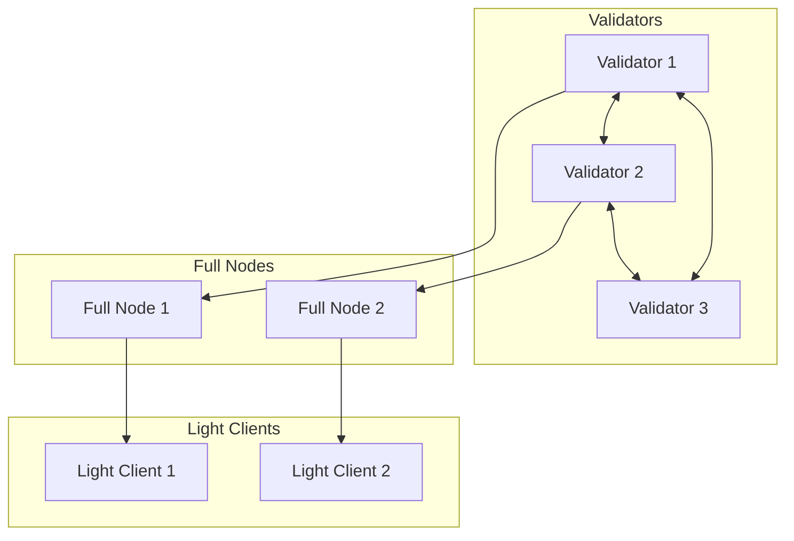
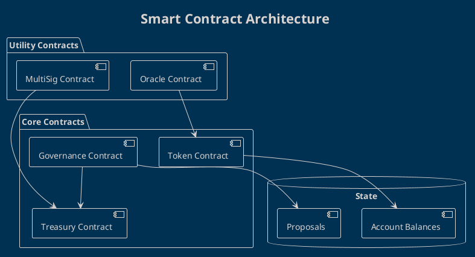
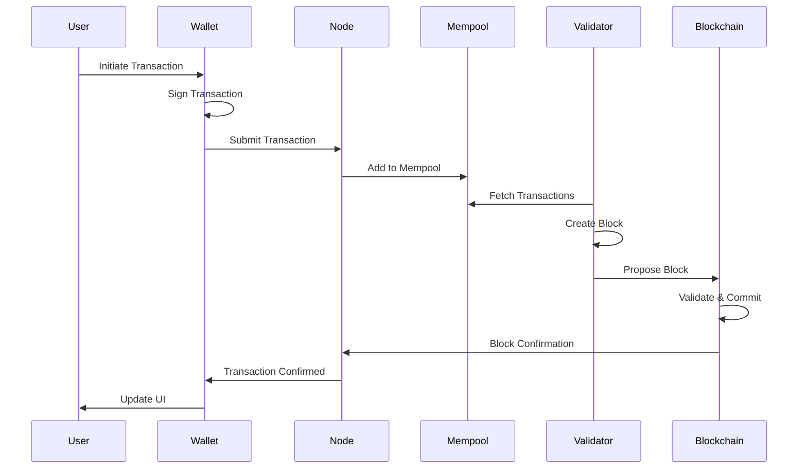

# Blockchain Architecture Documentation

## Overview

This directory contains blockchain-specific architecture documentation following industry best practices.

## Structure

```
blockchain/
├── consensus/           # Consensus mechanism documentation
├── smart-contracts/     # Contract architecture
├── network/            # Network topology and protocols
├── security/           # Security architecture
├── scalability/        # Scaling solutions
└── integration/        # Integration guides
```

## Key Components

### 1. Consensus Layer

Documentation for the consensus mechanism:
- Algorithm selection and rationale
- Validator requirements
- Block production process
- Finality guarantees
- Fork resolution

### 2. Smart Contract Layer

Architecture for smart contracts:
- Contract design patterns
- Upgrade mechanisms
- Gas optimization strategies
- Security considerations
- Testing approach

### 3. Network Layer

Network architecture:
- Node types and roles
- P2P communication
- RPC/API endpoints
- Network security
- Monitoring and metrics

### 4. Data Layer

Data management:
- State structure
- Storage solutions (on-chain/off-chain)
- Indexing strategy
- Archive nodes
- Data availability

## Documentation Standards

All blockchain architecture documents must include:

### Required Sections

1. **Overview**: High-level description
2. **Architecture Diagram**: Visual representation
3. **Technical Specifications**: Detailed specs
4. **Security Considerations**: Threat model and mitigations
5. **Performance Characteristics**: Benchmarks and limits
6. **Integration Guide**: How to integrate
7. **Monitoring**: Observability approach
8. **References**: Related docs and external resources

### Blockchain-Specific Requirements

Every architecture document should address:

- **Decentralization**: Impact on network properties
- **Immutability**: Upgrade and migration strategies
- **Gas Economics**: Cost implications
- **Security**: Attack vectors and defenses
- **Scalability**: Current and target performance
- **Interoperability**: Cross-chain considerations

## Creating New Documentation

1. Use the template: `.github/ARCHITECTURE_TEMPLATE.md`
2. Name with `blockchain-` prefix: `blockchain-consensus.md`
3. Include all required sections
4. Add relevant diagrams
5. Link to related ADRs
6. Submit PR to `architecture-docs` branch

## Diagram Guidelines

For blockchain diagrams, include:

### Network Topology



### Smart Contract Architecture



### Transaction Flow



## Key Considerations

### Consensus Mechanisms

When documenting consensus:
- Liveness properties
- Safety properties
- Byzantine fault tolerance
- Performance trade-offs

### Smart Contract Design

When documenting contracts:
- Upgradeability patterns (proxy, diamond, eternal storage)
- Access control mechanisms
- Gas optimization techniques
- Reentrancy protection
- Oracle integration

### Network Security

When documenting security:
- DDoS mitigation
- Sybil attack resistance
- Eclipse attack prevention
- Transaction privacy
- Key management

### Scalability Solutions

When documenting scaling:
- Layer 2 solutions (rollups, state channels)
- Sharding approach
- Off-chain computation
- Data availability guarantees

## Tools and Resources

### Analysis Tools

- **Mythril**: Smart contract security analysis
- **Slither**: Static analysis tool
- **Echidna**: Fuzzing tool
- **Manticore**: Symbolic execution

### Monitoring Tools

- **Block explorers**: Transaction and block data
- **Grafana**: Metrics visualization
- **Prometheus**: Metrics collection
- **Tendermint metrics**: Consensus metrics

### Development Tools

- **Hardhat**: Development environment
- **Foundry**: Testing framework
- **Remix**: Online IDE
- **OpenZeppelin**: Security libraries

## Compliance and Auditing

### Security Audits

Before mainnet launch:
1. Internal security review
2. External audit by reputable firm
3. Public bug bounty program
4. Formal verification (for critical contracts)

### Audit Checklist

- [ ] Access control reviewed
- [ ] Reentrancy protection verified
- [ ] Integer overflow/underflow checked
- [ ] Gas optimization reviewed
- [ ] Upgrade mechanism tested
- [ ] Oracle failure handling confirmed
- [ ] Emergency pause mechanism tested

## Performance Benchmarks

### Key Metrics

| Metric | Target | Current | Notes |
|--------|--------|---------|-------|
| TPS | 1000+ | TBD | Transactions per second |
| Block Time | 2s | TBD | Time between blocks |
| Finality | 5s | TBD | Time to finality |
| Gas Cost | <50k | TBD | Typical transaction |

## References

### Standards

- ERC-20: Token standard
- ERC-721: NFT standard
- ERC-1155: Multi-token standard
- EIP-2535: Diamond standard

### Research Papers

- Bitcoin Whitepaper
- Ethereum Whitepaper  
- Tendermint consensus
- Rollup research

### External Resources

- [Ethereum.org Documentation](https://ethereum.org/en/developers/docs/)
- [Cosmos Documentation](https://docs.cosmos.network/)
- [Polkadot Wiki](https://wiki.polkadot.network/)

---

**Last Updated**: 2026-02-25
**Maintained by**: @0xSoftBoi
**Questions**: Create an issue with label `blockchain-architecture`