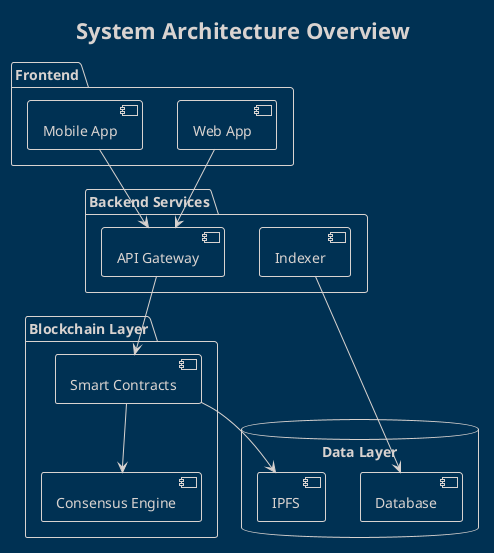
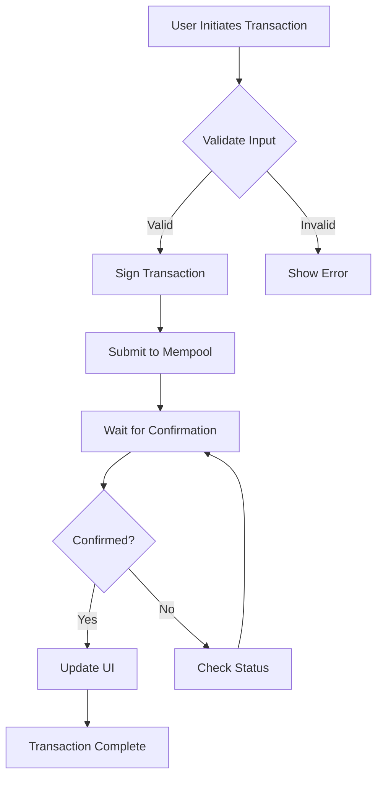
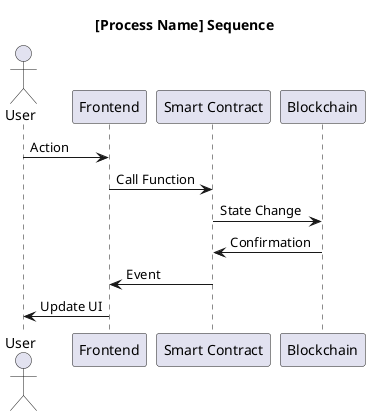
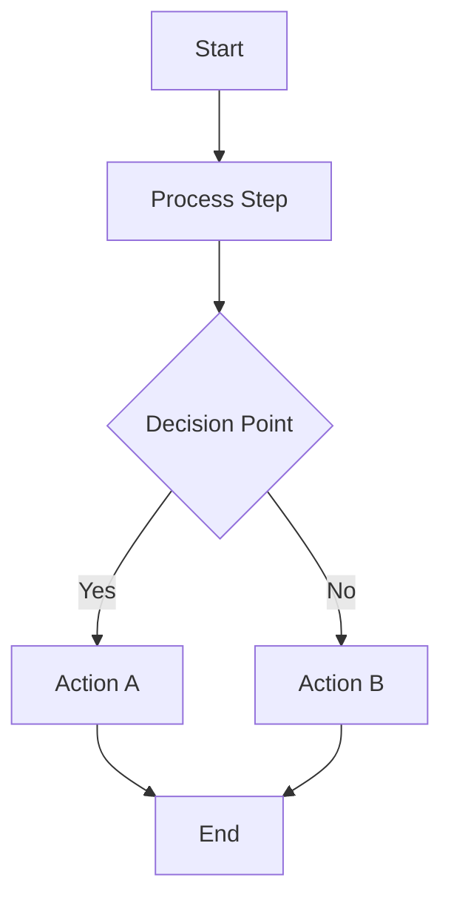

# Architecture Diagrams

## Overview

This directory contains all technical diagrams for the project, including:
- Architecture diagrams
- Blockchain network topology
- Smart contract interactions
- Process flows
- Sequence diagrams

## Diagram Types

### PlantUML (`.plantuml`, `.puml`)

Best for:
- UML diagrams (class, component, deployment)
- Sequence diagrams
- State diagrams
- Activity diagrams

### Mermaid (`.mermaid`)

Best for:
- Flowcharts
- State diagrams
- Gantt charts
- Git graphs
- Entity relationship diagrams

## Directory Structure

```
diagrams/
├── architecture/     # System architecture diagrams
├── blockchain/       # Blockchain-specific diagrams
├── contracts/        # Smart contract diagrams
├── flows/            # Process flow diagrams
├── network/          # Network topology diagrams
├── security/         # Security architecture
└── generated/        # Auto-generated images (PNG/SVG)
```

## Automated Generation

Diagrams are automatically generated when:
- Any `.plantuml`, `.puml`, or `.mermaid` file is committed
- A PR includes diagram changes
- Manually triggered via GitHub Actions

Generated files are placed in `generated/` directory in both PNG and SVG formats.

## Creating Diagrams

### PlantUML Example

Create a file `diagrams/architecture/system-overview.plantuml`:



### Mermaid Example

Create a file `diagrams/flows/transaction-flow.mermaid`:



## Diagram Standards

### Naming Conventions

- Use kebab-case: `system-architecture.plantuml`
- Be descriptive: `token-transfer-sequence.plantuml`
- Group by type: `blockchain-consensus-flow.mermaid`

### Content Guidelines

1. **Include a title** in every diagram
2. **Add legends** for complex diagrams
3. **Use consistent colors** across related diagrams
4. **Label arrows** to show data flow or relationships
5. **Keep it simple** - create multiple diagrams rather than one complex one

### Blockchain Diagrams

For blockchain-related diagrams, include:
- Node types and their roles
- Communication protocols
- Transaction flows
- State transitions
- Smart contract interactions

## Local Development

### Install Tools

```bash
# PlantUML (requires Java)
sudo apt-get install plantuml

# Or via Homebrew on macOS
brew install plantuml

# Mermaid CLI
npm install -g @mermaid-js/mermaid-cli
```

### Generate Diagrams Locally

```bash
# Generate all PlantUML diagrams
plantuml -tsvg diagrams/**/*.plantuml -o generated/
plantuml -tpng diagrams/**/*.plantuml -o generated/

# Generate all Mermaid diagrams
find diagrams -name "*.mermaid" -exec mmdc -i {} -o generated/{}.svg \;
find diagrams -name "*.mermaid" -exec mmdc -i {} -o generated/{}.png \;
```

### Preview in IDE

**VS Code Extensions:**
- PlantUML: `jebbs.plantuml`
- Mermaid: `bierner.markdown-mermaid`

**JetBrains IDEs:**
- PlantUML Integration plugin
- Mermaid plugin

## CI/CD Integration

The workflow `.github/workflows/generate-diagrams.yml`:

1. Detects diagram file changes
2. Generates PNG and SVG versions
3. Creates/updates diagram index
4. Commits generated files back to repo
5. Uploads artifacts for download

## Best Practices

### DO ✅

- Keep source files under version control
- Generate multiple formats (PNG for docs, SVG for web)
- Update diagrams when architecture changes
- Reference diagrams in ADRs and documentation
- Use consistent styling across diagrams

### DON'T ❌

- Manually edit generated images
- Commit ungenerated source files without images
- Create overly complex diagrams
- Use proprietary formats
- Forget to update related documentation

## Diagram Templates

### System Architecture Template


### Sequence Diagram Template



### Flow Diagram Template



## Resources

- [PlantUML Documentation](https://plantuml.com/)
- [Mermaid Documentation](https://mermaid-js.github.io/mermaid/)
- [PlantUML Online Editor](http://www.plantuml.com/plantuml/)
- [Mermaid Live Editor](https://mermaid.live/)

## Troubleshooting

**PlantUML not generating:**
- Check Java is installed: `java -version`
- Verify PlantUML syntax: `plantuml -syntax file.plantuml`

**Mermaid not generating:**
- Check Node.js is installed: `node --version`
- Verify Mermaid CLI: `mmdc --version`

**Diagrams not appearing in docs:**
- Check file paths are relative
- Ensure generated images exist
- Verify image format is supported (PNG/SVG)

---

**Last Updated**: 2026-02-25
**Workflow**: `.github/workflows/generate-diagrams.yml`